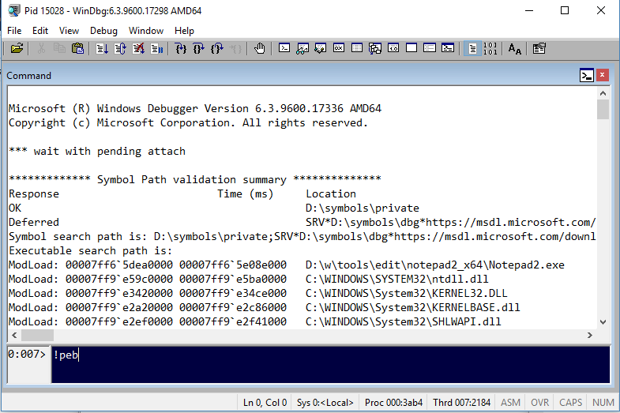

# Provision Great Debugging Experience on Windows

**Table of contents:**

- [Requirements](#requirements)
- [How to run the playbook](#how-to-run-the-playbook)
- [What's in the playbook](#whats-in-the-playbook)
- [Contributions](#contributions)

## Requirements

Currently, the scripts support **64-bit** systems only. You will need an Ansible host, which could be [a Linux box](http://docs.ansible.com/ansible/latest/installation_guide/intro_installation.html) or [Windows Subsystem for Linux](http://docs.ansible.com/ansible/latest/user_guide/windows_faq.html?highlight=windows%20subsystem#can-ansible-run-on-windows). You also need to configure the Windows machine to meet Ansible requirements as explained in [the Ansible documentation](http://docs.ansible.com/ansible/latest/user_guide/windows_setup.html). You must also install .NET 4.5+ (previous versions did not support TLS 1.2) and Powershell 3+.

## How to run the playbook

Clone this repository to a folder on your Ansible host. Then edit the **hosts inventory** to add the machines you would like to provision. For each group of hosts you may want to create a separate variables file under the **group_vars** folder where you will store custom settings and user credentials (**ansible_user** and **ansible_password**). *Remember to [encrypt the password](http://docs.ansible.com/ansible/latest/user_guide/playbooks_vault.html) if you plan to store it in the file*. 

The playbook uses the following variables (you may modify them through command line, by adding group variables file, or editing the group_vars/all.yml file):

Variable | Default Value | Description
---------|---------------|-------------
**tools_path** | C:\Program Files\Tools | A folder where diagnostics tools will be downloaded and saved
**symbols_path** | C:\Symbols | A folder for storing cached PDB symbol files
**dump_path** | C:\Dumps | A place where procudmp will store dumps of the crashing applications
**choco_apps** | [ 7zip, git ] | Chocolatey apps that should be installed while provisioning
**git_psmodules_tocheckout** | [] | Git repositories that contain PowerShell modules that you want to use. Ansible will checkout them in the `{{ tools_path }}\powershell\modules` folder. This folder will be added to the user `PSModulePath` environment variable. The list should contain objects with **name** and **repo_url** properties, for example: `git_psmodules_tocheckout: [{ name: "WintellectPowerShell", repo_url: "https://github.com/Wintellect/WintellectPowerShell.git" }]`
**psmodules_toinstall** | [] | Names of PowerShell modules which should be installed from the [PowerShell Gallery](https://www.powershellgallery.com/)

Example provisioning command:

```bash
$ ansible-playbook -k -i hosts playbook-debuggable-windows.yml --extra-vars "hosts=windows-local ansible_user=admin"
```

It is safe to run the playbook multiple times. It is the recommended way to upgrade the tools included in the set.

## What's in the playbook

Almost all the tools are implemented as roles. You may comment out those that you don't like (`#` is a comment character in yaml). For instance, if you don't like Process Hacker (shame on you!) you may remove it from provisioning:

```yaml
  ...
  roles:
  - notepad2
  - sysinternals
  # - process-hacker
  - debugging-tools
  ...
```

### Notepad2.mod to replace notepad

- In playbook: role `notepad2`
- Original source: <https://github.com/XhmikosR/notepad2-mod>
- Downloaded to: `{{ tools_path }}\edit`

A text editor similar to notepad on the outside, but much more powerful.

### Sysinternals Suite

- In playbook: role `sysinternals`
- Orignal source: <https://download.sysinternals.com/files/SysinternalsSuite.zip>
- Downloaded to: `{{ tools_path }}\sysinternals`

The whole Sysinternals Suite (with Nano versions), including tools such as **Process Monitor**, **Process Explorer**, or **psexec**. If you are a Windows administrator/developer it is a must-have. Apart from downloading the tools and adding them to the machine `PATH` variable, the scripts automatically:

- accept EULA for most of them (so you can run them safely in non-interactive way), so you should [read it](https://docs.microsoft.com/en-us/sysinternals/license-terms) to know what you have just accepted
- replace Task Manager with Process Explorer
- configure Procdump as a system debugger (AeDebug) - it will save 'MiniPlus' dumps under the `{{ dumps_path }}` folder

### Process Hacker

- In playbook: role `process-hacker`
- Original source: <https://wj32.org/processhacker/rel/processhacker-2.39-bin.zip>
- Downloaded to: `{{ tools_path }}\diag\processhacker`

The script will also:

- replace Task Manager with Process Hacker
- configure `_NT_SYMBOL_PATH`

### Windows Debugging Tools Configuration

- In playbook: role `debugging-tools`
- Requirement: **Windows SDK must be installed with Debugging Tools for Windows**

The script adds Debugging Tools to the machine `PATH` variable and configures WinDbg theme. After runnning the scripts your WinDbg window will look as follows:



You will also have at your disposition the following plugins:

Plugin name | Author/Source | Description
------------|---------------|-------------
mex | [Microsoft](https://www.microsoft.com/en-us/download/details.aspx?id=53304) | A lot of interesting commands from Microsoft support. Run `!mex.help` to learn more.
PDE | [Andrew Richards](https://onedrive.live.com/redir?resid=DAE128BD454CF957!7152&authkey=!AJeSzeiu8SQ7T4w&ithint=folder%2czip) | Another great plugin with commands to efficiently search through the process memory or analyze call stacks. It contains a bunch of utilities which will make your work with WinDbg easier.
sosex | [Steve Johnson](http://www.stevestechspot.com/) | The best plugin to debug .NET applications
NetExt | [Rodney Viana](https://github.com/rodneyviana/netext) | Another great plugin for debugging .NET applications, based on CLRMD
psscor4 | [Microsoft](https://www.microsoft.com/en-us/download/details.aspx?id=21255) | A set of extension commands to SOS [.NET 4.0 and earlier]

Additionally, a new context menu options be configured for the memory dump files. They will allow you to open the dump file in windbg (32-bit or 64-bit). The feature was presented by **Andrew Richards** in one of the episodes of the [Defrag Tools show](https://channel9.msdn.com/Shows/Defrag-Tools).

**The script won't install Windows SDK and if none is found, all the tasks will be skipped**.

### Windows Performance Toolkit Configuration

- In playbook: role `performance-toolkit`
- Requirement: **Windows 10/8.1 SDK must be installed with Windows Performance Toolkit**

The script adds Windows Performance Toolkit folder to the machine `PATH`, configure cache for xperf symbols, and adds a number of scripts to simplify usage of the Xperf command (scripts downloaded from the **Andrew Richards** [OneDrive](https://onedrive.live.com/redir?resid=DAE128BD454CF957!7152&authkey=!AJeSzeiu8SQ7T4w&ithint=folder%2czip)), such as `xperf - Collect CPU`, `xperf - Collect CPUWait`, etc.

**The script won't install Windows SDK and if none is found, all the tasks will be skipped**.

### dnSpy

- In playbook: role `dnspy`
- Original source: <https://github.com/0xd4d/dnSpy/releases>
- Downloaded to: `{{ tools_path }}\diag\dnSpy`

### Perfview

- In playbook: role `perfview`
- Original source: <https://github.com/Microsoft/perfview/releases>
- Downloaded to: `{{ tools_path }}\diag`

### Wtrace

- In playbook: role `wtrace`
- Original source: <https://github.com/lowleveldesign/wtrace/releases>
- Downloaded to: `{{ tools_path }}\diag`

### PowerShell Configuration

- In playbook: role `powershell`

Adds the `{{ tools_path }}\powershell\modules` folder to the `PSModulePath` system variables and checks out to it the repositories specified in the `git_psmodules_tocheckout` list. It will also install from the Powershell Gallery all the modules which names are in the `psmodules_toinstall` list.

### Touchcursor

- In playbook: role `touchcursor` **(disabled by default)**
- Original source: <https://sourceforge.net/projects/touchcursor/files/1.7.1/TouchCursor-1.7.1.zip/download>
- Downloaded to: `{{ tools_path }}\utils`

A word of explanation: this tool is not really a debugging tool (that's why it is disabled by default). I am a vim-syntax addict and wanted to have at least navigation keys available in application windows. Touchcursor allows you to do that by using a control key, such as space. Some of the mappings installed with this role (remember to enable it!) are:

- {space} + j - down arrow
- {space} + k - up arrow
- {space} + l - right arrow
- {space} + h - left arrow
- {space} + x - delete
- {space} + u - ctrl + pageup
- {space} + t - ctrl + tab
- {space} + 6/^ - home
- {space} + 4/$ - end

### Error Code Lookup

- In playbook: role `err`
- Original source: <https://download.microsoft.com/download/2/7/9/279ed965-1acb-4449-9054-46900909b401/Err.EXE>
- Downloaded to: `{{ tools_path }}\diag`

A great tool to lookup Windows error codes.

## Contributions

Please create an issue if you find an error in any of the configuration scripts. I will try to keep the tools up to date, but if you find any of them outdated please let me know, or create a pull request. Thank you.
